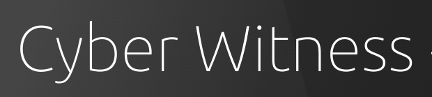
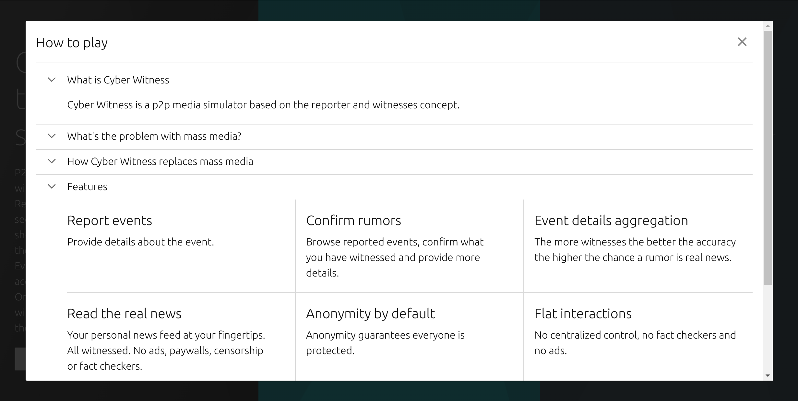
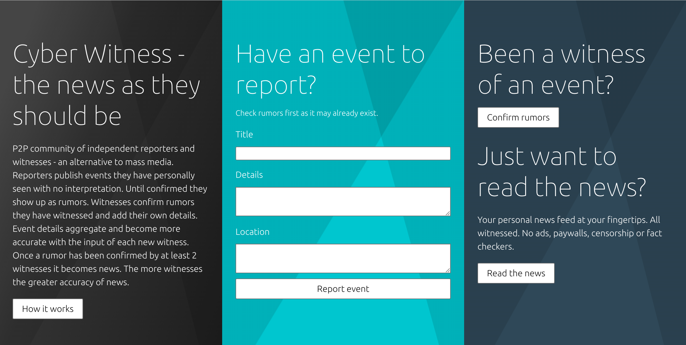
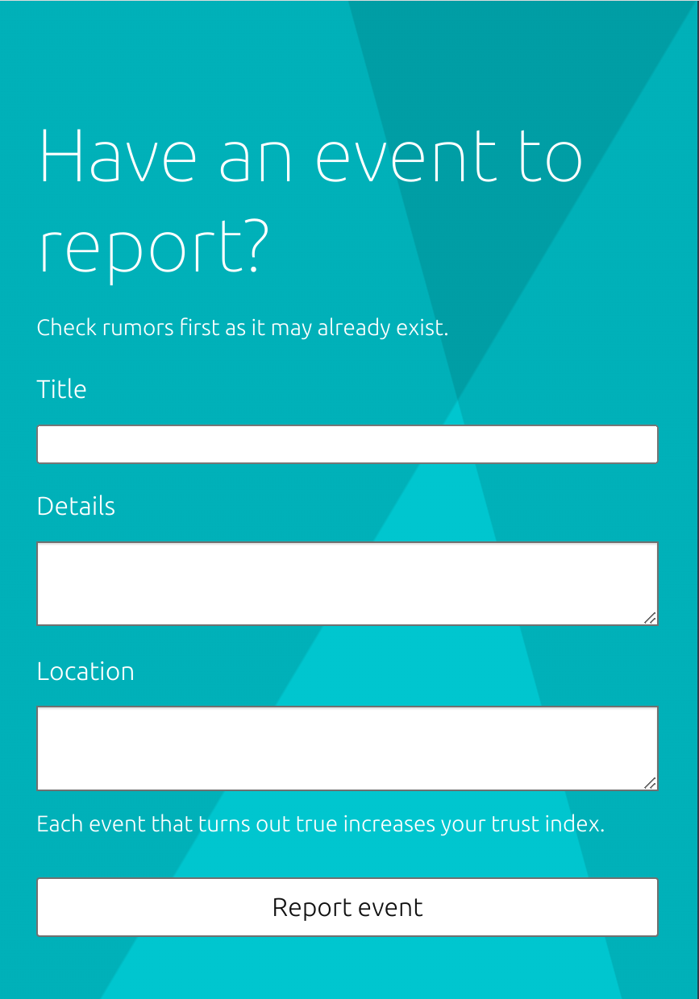
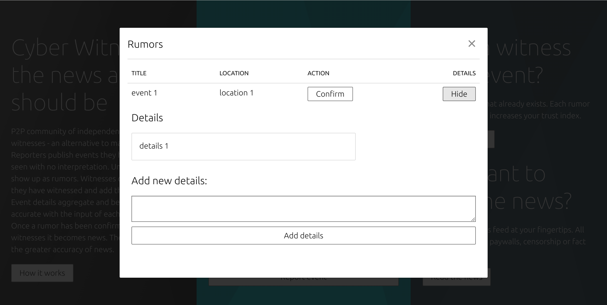
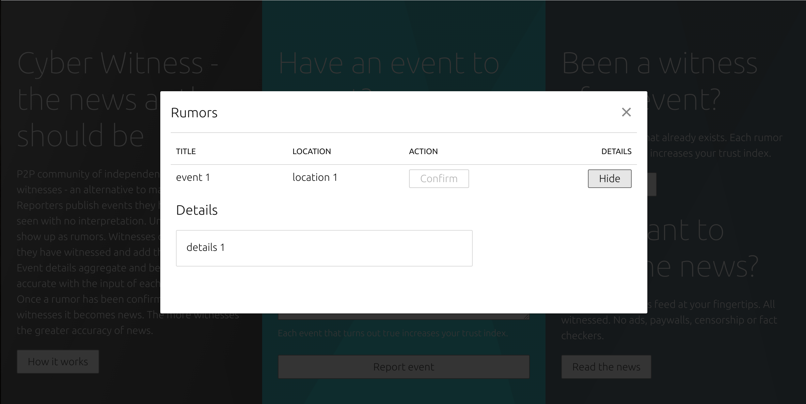
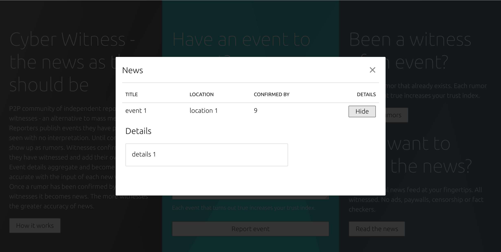
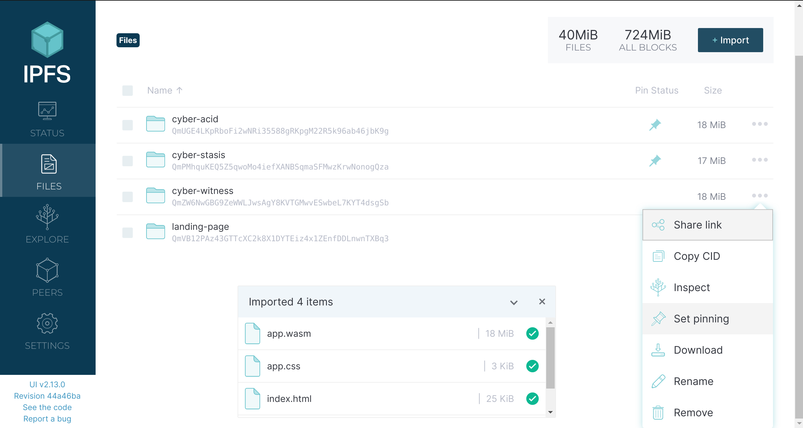
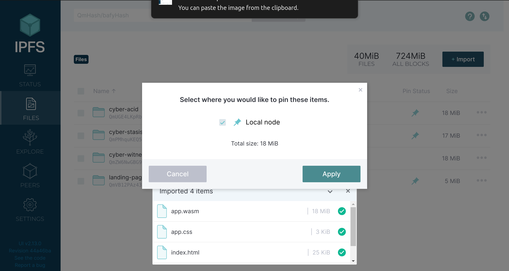

  

# Cyber Witness

  

  



Over the past few years we are seeing the end of free speech and the battle for communication control. Censorship, fact checking and surveillance are quickly becoming the norm. The end of free speech leads to the end of democracy as we know it. 

Cyber Witness is a P2P community of independent reporters and witnesses - an alternative to mass media. Reporters publish events they have personally seen with no interpretation. Until confirmed they show up as rumors. Witnesses confirm rumors they have witnessed and add their own details. Event details aggregate and become more accurate with the input of each new witness. Once a rumor has been confirmed by at least 2 witnesses it becomes news. The more witnesses the greater accuracy of news.

  
  

## Screenshots

  

  

<a  display="inline"  href="./assets/how-it-works.png?raw=true">

  



  

</a>

  

  

<a  display="inline"  href="./assets/home.png?raw=true">

  



  

</a>

  

  

<a  display="inline"  href="./assets/report-event.png?raw=true">

  



  

</a>

  

  

<a  display="inline"  href="./assets/confirm-rumor.png?raw=true">

  



  

</a>

  

  

<a  display="inline"  href="./assets/rumors.png?raw=true">

  



  

</a>

  
  
  

<a  display="inline"  href="./assets/news.png?raw=true">

  



  

</a>

## Features

  

  

*  ### Report events
    
    Provide details about the event.
    
-   ### Confirm rumors
    
    Browse reported events, confirm what you have witnessed and provide more details.
    
-   ### Event details aggregation
    
    The more witnesses the better the accuracy the higher the chance a rumor is real news.
    
-   ### Read the real news
    
    Your personal news feed at your fingertips. All witnessed. No ads, paywalls, censorship or fact checkers.
    
-   ### Anonymity by default
    
    Anonymity guarantees everyone is protected.
    
-   ### Flat interactions
    
    No centralized control, no fact checkers and no ads.

## Community

  

https://www.reddit.com/r/CyberWitness/

  
  

## How to Play

  

  

The simulator runs on the public IPFS network. In order to play it follow the steps below:

  

  

1. Install the official IPFS Desktop http://docs.ipfs.io/install/ipfs-desktop/

  

2. Install IPFS Companion http://docs.ipfs.io/install/ipfs-companion/

  

3. Clone https://github.com/stateless-minds/kubo to your local machine, build it with `make build` and run it with the following command: `~/cmd/ipfs/ipfs daemon --enable-pubsub-experiment`

  

4. Follow the instructions here to open your config file: https://github.com/ipfs/kubo/blob/master/docs/config.md. Usually it's `~/.ipfs/config` on Linux. Add the following snippet to the `HTTPHeaders`:

  

```{

  

"API": {

  

"HTTPHeaders": {

  

"Access-Control-Allow-Origin": ["webui://-", "http://localhost:3000", "http://k51qzi5uqu5djy7mki67x1goaq6znsinuirxz2ii3zewbxhjj2ea79etw1zcsh.ipns.localhost:8080", "http://127.0.0.1:5001", "https://webui.ipfs.io"],

  

"Access-Control-Allow-Credentials": ["true"],

  

"Access-Control-Allow-Methods": ["PUT", "POST"]

  

}

  

},

  

```

  

5. Navigate to <a  href="https://ipfs.io/ipns/k51qzi5uqu5djy7mki67x1goaq6znsinuirxz2ii3zewbxhjj2ea79etw1zcsh">Cyber Witness</a> and let's simulate the future together!

  

6. If you like the simulator consider pinning it to your local node so that you become a permanent host of it while you have IPFS daemon running

  



  



  

  

Please note the simulator has been developed on a WQHD resolution(2560x1440) and is currently not responsive or optimized for mobile devices. For best gaming experience if you play in FHD(1920x1080) please set your browser zoom settings to 150%.

## Acknowledgments

  

  

1.  <a  href="https://go-app.dev/">go-app</a>

  

2.  <a  href="https://ipfs.io/">IPFS</a>

  

3.  <a  href="https://berty.tech/">Berty</a>

  

4. All the rest of the authors who worked on the dependencies used! Thanks a lot!

  

  

## Contributing

  

  

<a  href="https://github.com/stateless-minds/cyber-witness/issues">Open an issue</a>

  

  

## License

  

  

Stateless Minds (c) 2022 and contributors

  

  

MIT License
